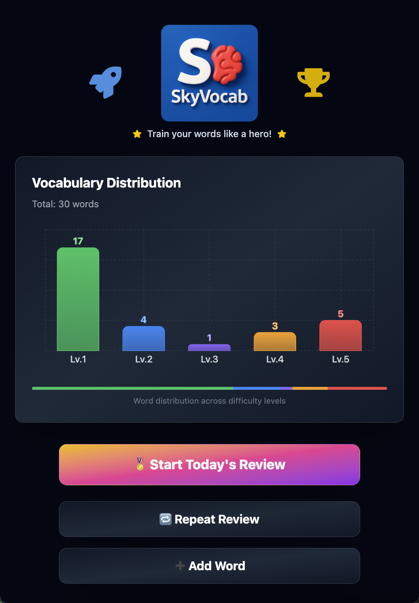
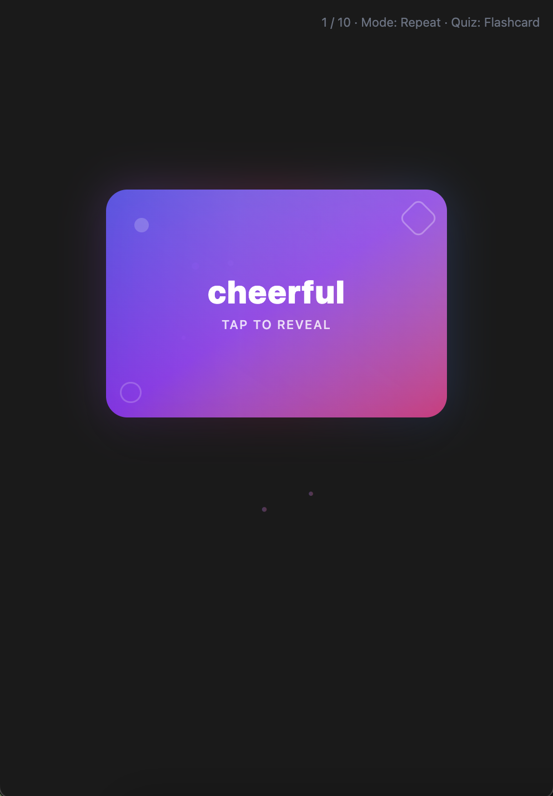

## 📚 SkyVocab Trainer – Vocabulary Learning Web App

SkyVocab Trainer is a web-based vocabulary trainer designed to help learners retain new words through spaced repetition and multiple quiz formats. Many existing vocabulary sites and apps require payment or lack certain quiz types. To make high-quality practice accessible to everyone, I built SkyVocab Trainer as a free, self-learning tool that anyone can use.

> **Mobile UI:** This web app is primarily designed for mobile devices. For the best experience, please open it on a smartphone.

## 🌐 Live Preview

**[View the project here](https://sky-vocab-trainer.vercel.app)**

## 📸 Preview Screenshot





## 📌 Features

- Five quiz modes for each word  
  - Flashcard – reveal meaning when flipped  
  - Multiple Choice (English→Thai)  
  - Fill in the Blank  
  - Typing (Thai→English)  
  - Listening (choose correct word from audio)  
- Spaced repetition logic  
  - Each word has a level (1–5) and `nextReviewDate`  
  - Automatic selection of words due for review today  
  - Distribution: ~50–60% from levels 1–2, ~25–30% from level 3, ~10–20% from levels 4–5  
- Vocabulary Stats Dashboard  
  - View all saved words with their current level, score, and part of speech  
  - Sort by columns (word, level, score, etc.) and search by keyword or translation  
  - Smooth animations when toggling between compact view (10 words) and full list  
- Repeat Review mode for on-demand practice across all levels  
- Word-level score accumulation  
  - Each quiz type awards points per correct answer  
  - Cumulative score triggers level increase when threshold is reached  
- Reward unlock animations (confetti or badges) for word milestones  
- Add new words manually (English, Thai translation, example sentences)  
- CSV/JSON import to bulk add word lists  
- Responsive design for desktop and mobile  
- Real-time feedback with popups indicating correct or incorrect answers  

## 🔧 Tech Stack

- **Next.js 15.3.2** – React framework with file-based routing  
- **React 19.0.0** – UI library  
- **TypeScript 5** – Static typing for components and API routes  
- **Tailwind CSS 4.1.8** – Utility-first styling  
- **Mongoose 8.15.1** – ODM for MongoDB  
- **Axios 1.9.0** – HTTP client for API requests  
- **Canvas-Confetti 1.9.3** – Confetti animations for reward effects  
- **Framer Motion 12.15.0** – Animation library for React  
- **Lucide React 0.511.0** – Icon components  
- **React Icons 5.5.0** – Additional icon library  
- **Recharts 2.15.3** – Charting library for statistics and progress visuals  
- **dotenv 16.5.0** – Environment variable management  
- **PostCSS 8.5.4** – CSS processing  
- **ESLint 9 + eslint-config-next 15.3.2** – Linting and code quality  
- **@types_node**, **@types_react**, **@types_react-dom**, **@types_canvas-confetti** – TypeScript definitions  

## 🚀 Getting Started

To run this project locally:

```bash
# 1. Clone the repository
git clone https://github.com/SkyJirayuDev/SkyVocab-Trainer.git

# 2. Navigate to the project directory
cd SkyVocab-Trainer

# 3. Install dependencies
npm install

# 4. Set up environment variables
# Create a file named .env.local in the root directory with:
# MONGODB_URI=<your MongoDB connection string>
# (If you implement authentication later, add any related variables here.)

# 5. Start the development server
npm run dev
```

Open [http://localhost:3000](http://localhost:3000) in your browser to view the app.

## 🎓 Learning Outcomes

Through developing SkyVocab Trainer, I practiced and demonstrated:

- Implementing spaced repetition algorithms for long-term vocabulary retention  
- Designing multiple interactive quiz components in React/Next.js  
- Building scalable schemas in Mongoose for word data, user progress, and review history  
- Creating responsive UI using Tailwind CSS that works across devices  
- Handling CSV/JSON file import for bulk word management  
- Integrating chart components using Recharts for progress visualization  
- Implementing reward animations with Canvas-Confetti and Framer Motion  
- Using Axios to fetch and submit data to API routes  
- Deploying a full-stack application to Vercel with CI/CD workflows  

## 👨‍💻 About the Developer

Created by **Sky Jirayu Saisuwan**  
This is a personal project to make vocabulary practice free and accessible for everyone.

- [LinkedIn Profile](https://www.linkedin.com/in/sky-j-saisuwan-603a44316/)  
- [GitHub: SkyJirayuDev](https://github.com/SkyJirayuDev)  